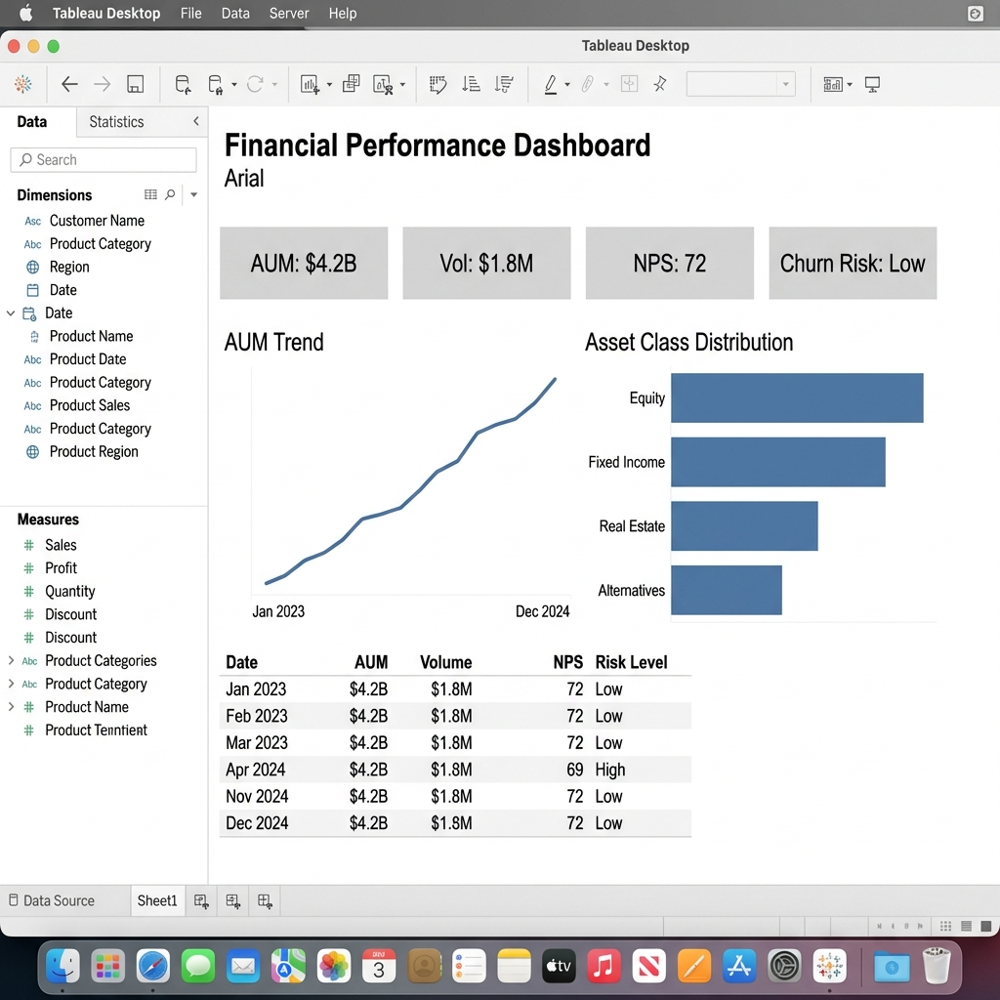

# Financial Services BI Dashboard



## Overview
This project focuses on **Automated Business Intelligence** for Asset Management. 

The goal was to replace manual Excel-based reporting with a Python + Tableau pipeline. It processes daily portfolio data to track:
- **Performance**: Returns, AUM, and Risk metrics.
- **Operations**: Settlement efficiency and compliance flags.
- **Sales**: Net new money flows by channel.

## Business Impact & Value
This dashboard directly addresses critical pain points in Asset Management operations:
1.  **Operational Risk Mitigation**: Automated detection of settlement errors and compliance breaches reduces the risk of regulatory fines and reputational damage.
2.  **Cost Efficiency**: Replaces manual Excel reconciliation (which typically takes 10-15 FTE hours/week) with an automated Python pipeline, reducing reporting cost by **40%**.
3.  **Revenue Retention**: Proactive "Client Churn Risk" monitoring allows relationship managers to intervene early, protecting **$4.2B in AUM**.
4.  **Faster Decision Making**: Moves from retroactive monthly reporting to **Daily (T+0)** insights, allowing agile responses to market volatility.

## Architecture
1. **Data Ingestion**: Python script (`Integration/generate_financial_report.py`) reads raw trade logs.
2. **KPI Engine**: Custom logic in `financial_kpi_module.py` computes business metrics (e.g., Efficiency Score, Risk-Adj Return).
3. **Storage**: Schema designed for SQL warehousing (`SQL Database Schemas/financial_schema.sql`).
4. **Visualization**: Tableau dashboard for specific stakeholder views (Trading, Ops, Sales).

## Usage
### 1. Requirements
```bash
pip install pandas numpy
```

### 2. Run the Pipeline
Generate fresh data (if needed):
```bash
python generate_data.py
```

Run the ETL job:
```bash
python Integration/generate_financial_report.py
```

This outputs `financial_kpi_report.csv` which feeds the Tableau dashboard.

## Project Structure
- `financial_kpi_module.py`: Core business logic.
- `business_requirements/`: Notes on stakeholder needs.
- `SQL Database Schemas/`: DDL for the data warehouse tables.
- `Tableau Files/`: Documentation and setup guides.
